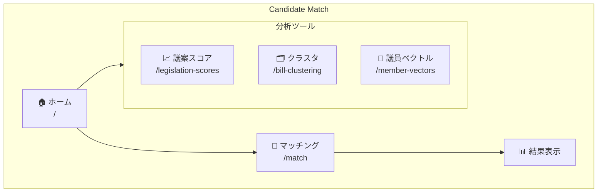
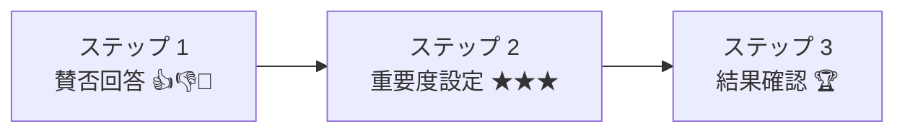
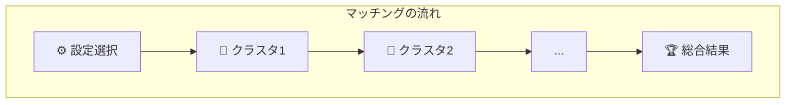

# ユーザーガイド / User Guide

Candidate Match は、あなたの政治的価値観に最も近い国会議員を見つけるためのプラットフォームです。

---

## 🗺️ プラットフォーム概要

---

## 📑 目次

1. [クイックスタート](#1-クイックスタート)
2. [議員マッチング（メイン機能）](#2-議員マッチング)
3. [議案別スコア分析](#3-議案別スコア分析)
4. [法案クラスタリング](#4-法案クラスタリング)
5. [議員ベクトル分析](#5-議員ベクトル分析)
6. [よくある質問](#6-よくある質問)
7. [トラブルシューティング](#7-トラブルシューティング)

---

## 1. クイックスタート

### 3ステップでマッチング結果を得る

1. **ホームページ** (`/`) にアクセス
2. 「**マッチングを始める**」をクリック
3. 表示される法案に「賛成」「反対」「わからない」で回答
4. 各分野の重要度を★1〜5で評価
5. 総合マッチ結果を確認！

---

## 2. 議員マッチング

### 概要

議員マッチングは本プラットフォームのメイン機能です。

| ステップ | 内容 |
|----------|------|
| 設定選択 | 保存済みベクトル設定を選択 |
| クラスタ1〜N | 法案に回答 → 重要度設定（全クラスター完了まで繰り返し） |
| 総合結果 | 加重平均でマッチ度算出 |

### ステップ 1: 設定を選択

`/match` ページで「保存済み設定」を選択します。

| 項目 | 説明 |
|------|------|
| 名前 | 分析データセットの名前 |
| クラスター数 | 政策分野の数（例：10分野） |
| 法案数 | 分析対象の法案数 |
| 議員数 | 分析対象の議員数 |
| 次元数 | 分析の精度（通常3次元） |

> 💡 **ヒント**: 設定がない場合は `/member-vectors` で新規作成できます

### ステップ 2: 法案に回答

各法案に対して3つの選択肢から回答します：

| 選択肢 | スコア | 説明 |
|--------|--------|------|
| 👍 **賛成** | +1 | この法案に賛成 |
| 🤷 **不明** | 0 | わからない・中立 |
| 👎 **反対** | -1 | この法案に反対 |

> 💡 各法案にはタイトルと説明（AIによる要約がある場合は表示）が付いています。

**適応型質問選択について:**

AIが「最も情報量の多い」法案を優先的に表示します：
- 議員間で意見が分かれる法案
- あなたの立ち位置をより明確にできる法案

### ステップ 3: 重要度を設定

各クラスター（政策分野）完了後、その分野の重要度を設定します：

| 評価 | 意味 | 計算への影響 |
|------|------|-------------|
| ★★★★★ | 最重要 | 5倍の重み |
| ★★★★☆ | 重要 | 4倍の重み |
| ★★★☆☆ | 普通（デフォルト） | 3倍の重み |
| ★★☆☆☆ | やや軽視 | 2倍の重み |
| ★☆☆☆☆ | 軽視 | 1倍の重み |

### ステップ 4: 結果を確認

マッチ結果は類似度ランキングとして表示されます：

| 順位 | 議員名 | 政党 | マッチ度 |
|------|--------|------|----------|
| 🏆 1位 | 山田 太郎 | ○○党 | 92.3% |
| 🥈 2位 | 鈴木 花子 | △△党 | 87.1% |
| 🥉 3位 | 佐藤 一郎 | □□党 | 84.5% |
| 4位 | 田中 次郎 | ○○党 | 81.2% |
| 5位 | 高橋 三郎 | △△党 | 79.8% |
| ... | ... | ... | ... |

### セッションの保存と再開

**保存:**
- 「セッションを保存」ボタンで現在の進捗を保存
- セッション名を入力して保存

**再開:**
- `/match/saved` ページから保存済みセッションを選択
- 前回の回答から続行可能

---

## 3. 議案別スコア分析

URL: `/legislation-scores`

各法案に対する議員のスコアを確認できます。

### 画面構成

ページを開くと、全法案がカード形式で一覧表示されます。

**検索・フィルタ機能:**
- 🔍 検索ボックスで法案タイトルを検索
- 並び替え：法案ID順、賛成者数順、反対者数順、平均スコア順

**法案カードの例:**

| 法案番号 | タイトル | 会期 | 賛成 | 反対 | 平均 |
|----------|----------|------|------|------|------|
| 閣法1 | 平成三十年度分として交付すべき... | 第198回 | +599 | -26 | +2.8 |
| 閣法2 | 警察法の一部を改正する法律案 | 第198回 | +592 | -30 | +2.8 |

### 使い方

#### 法案一覧

ページを開くと、全法案がカード形式で表示されます。

**各カードの情報:**
- 法案番号（例：第215回 閣法 第1号）
- 法案タイトル
- 賛成スコアを持つ議員数
- 反対スコアを持つ議員数
- 平均スコア

**検索・ソート:**
- 検索ボックスで法案タイトルを検索
- ソートオプション：
  - 法案ID順
  - 賛成者数順
  - 反対者数順
  - 平均スコア順

#### 法案詳細

法案カードをクリックすると詳細画面が表示されます。

**表示内容:**

1. **スコア分布グラフ**
   - 横棒グラフで全議員のスコアを可視化
   - 緑色 = 賛成傾向
   - 赤色 = 反対傾向
   - グレー = 中立

2. **議員テーブル**
   - 全議員のスコア一覧
   - 議員名、政党、スコア
   - スコア順にソート済み

3. **統計情報**
   - 賛成者数
   - 反対者数
   - 平均スコア

### スコア計算方法

| 行動 | スコア |
|------|--------|
| 法案提出者 | +10 |
| 法案賛成者（連名） | +5 |
| 押しボタン投票で賛成 | +5 |
| 押しボタン投票で反対 | -5 |
| 起立投票で賛成（会派） | +2 |
| 起立投票で反対（会派） | -2 |

---

## 4. 法案クラスタリング

URL: `/bill-clustering`

機械学習で法案を類似性に基づいてグループ化します。

### 使い方

1. **既存のクラスタリング結果を表示**
   - 保存済みの結果から選択

2. **新しいクラスタリングを生成**
   - クラスタリング名を入力
   - クラスタ数を設定（推奨: 8〜12）
   - 「クラスタリング実行」をクリック

### クラスターの例

クラスタリング結果の例（10クラスタの場合）：

| クラスター名 | 法案数 |
|--------------|--------|
| 📁 経済・財政政策 | 127法案 |
| 📁 社会保障・福祉 | 98法案 |
| 📁 環境・エネルギー | 45法案 |
| 📁 外交・安全保障 | 67法案 |
| 📁 教育・科学技術 | 52法案 |
| ... | ... |

---

## 5. 議員ベクトル分析

URL: `/member-vectors`

議員の投票パターンを多次元ベクトルとして可視化します。

### 設定項目

| 項目 | 説明 |
|------|------|
| クラスタリング設定 | ベースとなる法案クラスタリング |
| 潜在次元数 | 1〜5次元（推奨: 3次元） |
| 保存名 | 分析結果の名前 |

#### 結果の表示

**2D散布図:**
- 各議員を点としてプロット
- 近い点 = 投票パターンが類似
- 色分け = 政党

**次元の解釈:**
- 各次元を定義する代表的な法案が表示
- 例: 次元1 = 「環境規制に積極的 ↔ 消極的」

**議員検索:**
- 特定の議員を検索してハイライト
- 類似議員のリストを表示

#### ベクトルの保存

分析結果は「データベースに保存」ボタンで保存できます。
保存したベクトルは議員マッチング機能で使用されます。

---

## 6. よくある質問

### Q: 何問回答すれば良い？

**A:** 回答数が多いほど信頼度が上がります。

| 回答数 | 信頼度 |
|--------|--------|
| 5問 | 参考程度 |
| 10問 | ある程度信頼可能 |
| 20問以上 | 高い信頼度 |

信頼度メーターで現在の信頼度を確認できます。

### Q: 「わからない」を選んでも大丈夫？

**A:** はい、問題ありません。「わからない」（スコア0）は中立として処理され、その法案はマッチング計算に大きく影響しません。無理に賛成/反対を選ぶよりも、正直に「わからない」を選ぶ方が正確な結果が得られます。

### Q: なぜ特定の法案が表示される？

**A:** AI が「最も情報量が多い」法案を優先的に表示します。具体的には：
- 議員間で意見が分かれる法案（議論を呼ぶテーマ）
- まだ不確実性が高い次元を解消できる法案

### Q: データの出典は？

**A:** 全てのデータは以下の公式ソースから取得しています：
- 参議院ウェブサイト (sangiin.go.jp)
- 衆議院ウェブサイト (shugiin.go.jp)
- 首相官邸ウェブサイト (kantei.go.jp)
- 国会会議録検索システム (kokkai.ndl.go.jp)
- 日本法令索引 (hourei.ndl.go.jp)

### Q: セッションはどれくらい保存される？

**A:** 保存したセッションはデータベースに永続的に保存されます。いつでも `/match/saved` から再開できます。

### Q: モバイルで使える？

**A:** はい、レスポンシブデザインに対応しています。ただし、2D可視化などの一部機能はPC画面での利用を推奨します。

---

## 7. トラブルシューティング

| 問題 | 解決策 |
|------|--------|
| 設定が表示されない | `/member-vectors` で新規作成 |
| マッチ結果が極端 | より多くの法案に回答 |
| ページが重い | ブラウザを更新 |

技術的な問題やフィードバックは GitHub Issues でお知らせください。

---

*Last updated: December 2025*
