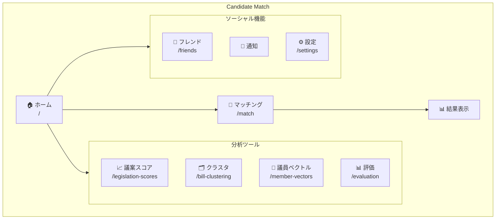
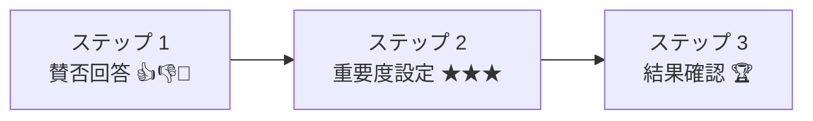
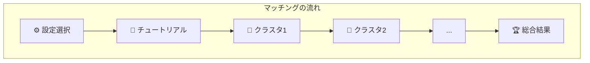
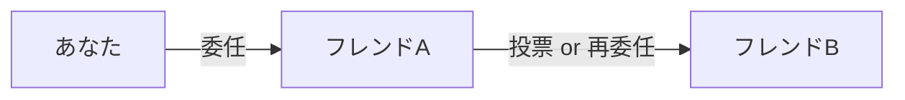

# ユーザーガイド / User Guide

Candidate Match は、あなたの政治的価値観に最も近い国会議員を見つけるためのプラットフォームです。

---

## 🗺️ プラットフォーム概要

```mermaid
flowchart TB
    subgraph main["Candidate Match"]
        Home["🏠 ホーム<br/>/"] --> Match["🎯 マッチング<br/>/match"]
        Match --> Result["📊 結果表示"]
        
        Home --> Tools
        subgraph Tools["分析ツール"]
            Scores["📈 議案スコア<br/>/legislation-scores"]
            Cluster["🗂️ クラスタ<br/>/bill-clustering"]
            Vectors["📐 議員ベクトル<br/>/member-vectors"]
            Eval["📊 評価<br/>/evaluation"]
        end
        
        Home --> Social
        subgraph Social["ソーシャル機能"]
            Friends["👥 フレンド<br/>/friends"]
            Notifications["🔔 通知"]
            Settings["⚙️ 設定<br/>/settings"]
        end
    end
```

---

## 📑 目次

1. [クイックスタート](#1-クイックスタート)
2. [議員マッチング（メイン機能）](#2-議員マッチング)
3. [フレンド機能](#3-フレンド機能)
4. [投票委任（リキッドデモクラシー）](#4-投票委任リキッドデモクラシー)
5. [通知システム](#5-通知システム)
6. [議案別スコア分析](#6-議案別スコア分析)
7. [法案クラスタリング](#7-法案クラスタリング)
8. [議員ベクトル分析](#8-議員ベクトル分析)
9. [アルゴリズム評価](#9-アルゴリズム評価)
10. [ユーザー設定](#10-ユーザー設定)
11. [よくある質問](#11-よくある質問)
12. [トラブルシューティング](#12-トラブルシューティング)

---

## 1. クイックスタート

### 3ステップでマッチング結果を得る

```mermaid
flowchart LR
    Step1["ステップ 1<br/>賛否回答 👍👎🤷"] 
    Step2["ステップ 2<br/>重要度設定 ★★★"]
    Step3["ステップ 3<br/>結果確認 🏆"]
    
    Step1 --> Step2 --> Step3
```

1. **ホームページ** (`/`) にアクセス
2. 「**マッチングを始める**」をクリック
3. 初回はチュートリアルが表示されます（投票の操作方法を練習できます）
4. 表示される法案に「賛成」「反対」「わからない」で**長押し投票**（600ms ホールド）
5. 各分野の重要度を★1〜5で評価
6. 総合マッチ結果を確認！

> 💡 アカウント登録すると、回答の保存・スナップショット・フレンド機能・投票委任が利用できます

---

## 2. 議員マッチング

### 概要

議員マッチングは本プラットフォームのメイン機能です。

```mermaid
flowchart TB
    subgraph flow["マッチングの流れ"]
        A["⚙️ 設定選択"] --> T["📖 チュートリアル"]
        T --> B["📁 クラスタ1"]
        B --> C["📁 クラスタ2"]
        C --> D["..."]
        D --> E["🏆 総合結果"]
    end
```

| ステップ | 内容 |
|----------|------|
| 設定選択 | 保存済みベクトル設定を選択（デフォルト設定が自動選択される場合あり） |
| チュートリアル | 初回訪問時に操作方法と仕組みを説明（スキップ可） |
| クラスタ1〜N | 法案に回答 → 重要度設定（全クラスター完了まで繰り返し） |
| 総合結果 | 加重平均でマッチ度算出 |

### ステップ 1: 設定を選択

`/match` ページで「保存済み設定」を選択します。デフォルト設定がある場合は自動選択されます。

| 項目 | 説明 |
|------|------|
| 名前 | 分析データセットの名前 |
| クラスター数 | 政策分野の数（例：10分野） |
| 法案数 | 分析対象の法案数 |
| 議員数 | 分析対象の議員数 |
| 次元数 | 分析の精度（通常3次元） |

> 💡 **ヒント**: 設定がない場合は `/member-vectors` で新規作成できます。管理者はデフォルト設定をマークできます。

### ステップ 2: チュートリアル（初回のみ）

初回マッチング時にチュートリアルモーダルが表示されます：

| タブ | 内容 |
|------|------|
| **使い方** | 4ステップで操作方法を解説。長押し投票の練習、クラスター切替の操作、重要度設定のデモが可能 |
| **仕組み** | 適応型質問選択、潜在空間マッチング、コサイン類似度などの技術的な仕組みを図解 |

### ステップ 3: 法案に回答

各法案に対して**長押し投票**で回答します（ボタンを600ms以上ホールドして確定）：

| 選択肢 | 値 | 説明 |
|--------|------|------|
| 👍 **賛成** | `yes` | この法案に賛成 |
| 🤷 **不明** | `skip` | わからない・中立 |
| 👎 **反対** | `no` | この法案に反対 |

> 💡 各法案にはタイトルと説明（AIによる要約がある場合は表示）が付いています。法案カードをクリックすると詳細パネルが表示されます。

**質問画面の機能：**

| 機能 | 説明 |
|------|------|
| クラスター進捗チップ | 水平スクロールで全クラスターの進捗を確認・切替 |
| 進捗バー | 現在のクラスター内の回答済み/全体の比率 |
| 統計バッジ | 回答数 / スキップ数 / 委任済み / 委任中 / 未回答数 |
| 信頼度バッジ | 現在の信頼度をツールチップ付きで表示 |
| 回答履歴 | 直近4件の回答を表示、クリックで回答を編集可能 |
| 中間結果パネル | リアルタイムで暫定マッチ結果を表示（閉/狭/全の3モード） |
| フレンドに委任 | ログイン済みの場合、法案をフレンドに委任可能 |

**適応型質問選択について:**

AIが「最も情報量の多い」法案を優先的に表示します：
- 議員間で意見が分かれる法案
- あなたの立ち位置をより明確にできる法案

### ステップ 4: 重要度を設定

各クラスター（政策分野）完了後、その分野の重要度を設定します：

| 評価 | 意味 | 計算への影響 |
|------|------|-------------|
| ★★★★★ | 最重要 | 5倍の重み |
| ★★★★☆ | 重要 | 4倍の重み |
| ★★★☆☆ | 普通（デフォルト） | 3倍の重み |
| ★★☆☆☆ | やや軽視 | 2倍の重み |
| ★☆☆☆☆ | 軽視 | 1倍の重み |

### ステップ 5: 結果を確認

マッチ結果は4つのタブで表示されます：

**① 概要タブ**

トップ3マッチをゴールド/シルバー/ブロンズのカードで表示。各カードには：
- 議員名・所属政党
- 総合マッチ度（%）
- 分野別マッチ度の棒グラフ（緑≥70%、青≥50%、赤<50%）

加えてクラスタ別の上位マッチも表示。

**② 回答記録タブ**

クラスタ別に以下を表示：
- 重要度★
- 潜在空間2D可視化（散布図にユーザーの位置と全議員の位置）
- 回答済み法案カード一覧

**③ 全議員リストタブ**

全議員の検索・ソート可能なテーブル：

| 順位 | 議員名 | 政党 | マッチ度 |
|------|--------|------|----------|
| 🏆 1位 | 山田 太郎 | ○○党 | 92.3% |
| 🥈 2位 | 鈴木 花子 | △△党 | 87.1% |
| 🥉 3位 | 佐藤 一郎 | □□党 | 84.5% |
| ... | ... | ... | ... |

議員をクリックすると詳細ドロワーが表示（所属政党・会派の履歴、法案別スコア比較）。

**④ 政党マッチタブ**

政党単位でのマッチ度を表示。2つのモード：
- **現在の所属議員ベース**: 現在の所属議員のマッチ度平均
- **歴史的ベース**: 議員の在籍期間と法案日の時間的重なりで重み付け

### セッションの保存

**スナップショット:**
- 結果画面で「スナップショットを保存」ボタンからスナップショット名を入力して保存
- `/match/saved` からスナップショット一覧を確認・閲覧可能

**回答データ:**
- 回答はユーザーアカウントにグローバルに保存されます（セッション単位ではなく）
- いつでも `/match/saved` の「回答履歴」タブから確認・管理可能
- 「マッチングを続ける」ボタンで未回答の法案に続けて回答可能

**ライブ結果:**
- `/match/saved` ページでベクトル設定を選択し、現在の回答からリアルタイムで結果を再計算可能
- クラスタ別の重要度を調整してから再計算も可能
- 結果をスナップショットとして保存可能

---

## 3. フレンド機能

URL: `/friends`

他のユーザーとフレンドになり、投票委任などのソーシャル機能を利用できます。

### 画面構成（3タブ）

**① フレンド一覧タブ**
- フレンドのアバター、ユーザー名、フレンド登録日を表示
- フレンド解除ボタン（確認ダイアログ付き）

**② リクエストタブ**
- 受信リクエスト：承認/拒否ボタン
- 送信リクエスト：キャンセルボタン
- 未処理件数がバッジで表示

**③ ユーザー検索タブ**
- ユーザー名で検索（300msデバウンス）
- 検索結果にフレンド状態を表示：
  - フレンド済み → 「フレンド」表示
  - リクエスト送信済み → 「リクエスト済み」表示
  - リクエスト受信中 → 「承認」ボタン表示
  - 未接続 → 「リクエスト送信」ボタン

> 💡 ナビバーのユーザーアイコン横に未処理フレンドリクエストの赤ドットが表示されます

---

## 4. 投票委任（リキッドデモクラシー）

マッチング中の法案回答をフレンドに委任できます。

### 委任の流れ

```mermaid
flowchart LR
    A["あなた"] -->|委任| B["フレンドA"]
    B -->|投票 or 再委任| C["フレンドB"]
```

1. 法案の回答画面で「フレンドに委任」をクリック
2. フレンド一覧から委任先を選択
3. 委任先フレンドに通知が届く
4. フレンドは以下のアクションが可能：
   - **投票**: あなたの代わりに賛成/反対/スキップを回答
   - **拒否**: 委任を拒否（あなたの委任状態が解除）
   - **再委任**: 別のフレンドに委任を転送（チェーン形成）

### 委任の管理

| 操作 | 場所 | 説明 |
|------|------|------|
| 委任する | マッチング質問画面 | 法案ごとにフレンドへ委任 |
| 委任を撤回 | `/match/saved` の委任タブ | いつでも委任を取り消し可能 |
| 直接投票で上書き | マッチング質問画面 | 委任中でも自分で投票すると委任がキャンセルされる |
| 受信委任を管理 | `/match/saved` の委任タブ | 受信した委任に投票・拒否・再委任 |

### 委任チェーンの可視化

`/match/saved` の委任タブでは、`DelegationFlowChart` を使って委任チェーンをフローチャートで可視化できます。

> ⚠️ 循環委任（A→B→C→A）は自動的に検出・防止されます

---

## 5. 通知システム

ナビバーの🔔アイコンからアクセスできるドロップダウン通知システムです。

### 通知の種類

| カテゴリ | 通知タイプ | 説明 |
|----------|------------|------|
| フレンド | リクエスト受信 | フレンドリクエストが届いた |
| フレンド | リクエスト承認 | フレンドリクエストが承認された |
| フレンド | リクエスト拒否 | フレンドリクエストが拒否された |
| 委任 | 委任受信 | 法案の委任依頼が届いた |
| 委任 | 委任拒否 | 委任が拒否された |
| 委任 | 再委任 | 委任が再委任された |
| 委任 | 投票完了 | 委任先が投票した |
| 委任 | 委任撤回 | 委任者が委任を撤回した |
| 委任 | 投票変更 | 委任先が投票を変更した |
| 委任 | 上書き | 委任者が直接投票で上書きした |

**機能:**
- 未読件数バッジ
- カーソルベースのページネーション（「もっと読み込む」）
- 個別/一括の既読処理
- 通知クリックで関連ページに遷移

---

## 6. 議案別スコア分析

URL: `/legislation-scores`

各法案に対する議員のスコアを確認できます。

### 画面構成

ページを開くと、全法案がカード形式で一覧表示されます。

**検索・フィルタ機能:**
- 🔍 検索ボックスで法案タイトルを検索
- 並び替え：法案ID順、賛成者数順、反対者数順、平均スコア順

**法案カードの例:**

| 法案番号 | タイトル | 会期 | 賛成 | 反対 | 平均 |
|----------|----------|------|------|------|------|
| 閣法1 | 平成三十年度分として交付すべき... | 第198回 | +599 | -26 | +2.8 |
| 閣法2 | 警察法の一部を改正する法律案 | 第198回 | +592 | -30 | +2.8 |

### 使い方

#### 法案一覧

ページを開くと、全法案がカード形式で表示されます。

**各カードの情報:**
- 法案番号（例：第215回 閣法 第1号）
- 法案タイトル
- 賛成スコアを持つ議員数
- 反対スコアを持つ議員数
- 平均スコア

**検索・ソート:**
- 検索ボックスで法案タイトルを検索
- ソートオプション：
  - 法案ID順
  - 賛成者数順
  - 反対者数順
  - 平均スコア順

#### 法案詳細

法案カードをクリックすると詳細画面が表示されます。

**表示内容:**

1. **スコア分布グラフ**
   - 横棒グラフで全議員のスコアを可視化
   - 緑色 = 賛成傾向
   - 赤色 = 反対傾向
   - グレー = 中立

2. **議員テーブル**
   - 全議員のスコア一覧
   - 議員名、政党、スコア
   - スコア順にソート済み

3. **統計情報**
   - 賛成者数
   - 反対者数
   - 平均スコア

### スコア計算方法

| 行動 | スコア |
|------|--------|
| 法案提出者 | +10 |
| 法案賛成者（連名） | +5 |
| 参議院の個人投票で賛成 | +5 |
| 参議院の個人投票で反対 | -5 |
| 衆議院の会派投票で賛成 | +2 |
| 衆議院の会派投票で反対 | -2 |
| 提出者と同一会派所属 | +2 |

> 💡 衆議院は会派単位、参議院は個人単位で投票記録を集計しています

---

## 7. 法案クラスタリング

URL: `/bill-clustering`

機械学習で法案を類似性に基づいてグループ化します。

### 使い方

1. **既存のクラスタリング結果を表示**
   - 保存済みの結果から選択

2. **新しいクラスタリングを生成**
   - クラスタリング名を入力
   - クラスタ数を設定（推奨: 8〜12）
   - 「クラスタリング実行」をクリック

### クラスターの例

クラスタリング結果の例（10クラスタの場合）：

| クラスター名 | 法案数 |
|--------------|--------|
| 📁 経済・財政政策 | 127法案 |
| 📁 社会保障・福祉 | 98法案 |
| 📁 環境・エネルギー | 45法案 |
| 📁 外交・安全保障 | 67法案 |
| 📁 教育・科学技術 | 52法案 |
| ... | ... |

---

## 8. 議員ベクトル分析

URL: `/member-vectors`

議員の投票パターンを多次元ベクトルとして可視化します。

### 設定項目

| 項目 | 説明 |
|------|------|
| クラスタリング設定 | ベースとなる法案クラスタリング |
| 潜在次元数 | 1〜5次元（推奨: 3次元） |
| 保存名 | 分析結果の名前 |

#### 結果の表示

**2D散布図:**
- 各議員を点としてプロット
- 近い点 = 投票パターンが類似
- 色分け = 政党

**次元の解釈:**
- 各次元を定義する代表的な法案が表示
- 例: 次元1 = 「環境規制に積極的 ↔ 消極的」

**議員検索:**
- 特定の議員を検索してハイライト
- 類似議員のリストを表示

#### ベクトルの保存

分析結果は「データベースに保存」ボタンで保存できます。
保存したベクトルは議員マッチング機能で使用されます。

---

## 9. アルゴリズム評価

URL: `/evaluation`

マッチングアルゴリズムの精度を評価するツールです。

### 使い方

1. 保存済みベクトル設定を選択
2. 評価戦略を実行
3. 集計メトリクスを確認：コサイン誤差、ベクトルMSE、不確実性、真の順位、Top-5命中率、収束度
4. 議員単位の詳細結果をステップごとに確認可能

---

## 10. ユーザー設定

URL: `/settings`

### 設定項目

| 設定 | 説明 |
|------|------|
| プロフィール画像 | アバター画像のアップロード・削除（JPEG/PNG/WebP/GIF、最大5MB） |
| ユーザー名 | ユーザー名の変更（英数字・ハイフン・アンダースコア、3〜32文字） |
| パスワード変更 | 現在のパスワードと新しいパスワードを入力（8〜128文字） |

---

## 11. よくある質問

### Q: 何問回答すれば良い？

**A:** 回答数が多いほど信頼度が上がります。

| 回答数 | 信頼度 |
|--------|--------|
| 5問 | 参考程度 |
| 10問 | ある程度信頼可能 |
| 20問以上 | 高い信頼度 |

信頼度メーターで現在の信頼度を確認できます。

### Q: 「わからない」を選んでも大丈夫？

**A:** はい、問題ありません。「わからない」（スコア0）は中立として処理され、その法案はマッチング計算に大きく影響しません。無理に賛成/反対を選ぶよりも、正直に「わからない」を選ぶ方が正確な結果が得られます。

### Q: なぜ特定の法案が表示される？

**A:** AI が「最も情報量が多い」法案を優先的に表示します。具体的には：
- 議員間で意見が分かれる法案（議論を呼ぶテーマ）
- まだ不確実性が高い次元を解消できる法案

### Q: データの出典は？

**A:** 全てのデータは以下の公式ソースから取得しています：
- 参議院ウェブサイト (sangiin.go.jp)
- 衆議院ウェブサイト (shugiin.go.jp)
- 首相官邸ウェブサイト (kantei.go.jp)
- 国会会議録検索システム (kokkai.ndl.go.jp)
- 日本法令索引 (hourei.ndl.go.jp)

### Q: セッションはどれくらい保存される？

**A:** 回答データはユーザーアカウントにグローバルに保存されます。スナップショットもデータベースに永続保存されます。いつでも `/match/saved` から確認・再開できます。

### Q: 投票委任とは？

**A:** マッチング中に回答が難しい法案をフレンドに委任できる機能です。委任先フレンドがあなたの代わりに投票し、その結果がマッチング計算に反映されます。委任はチェーン（再委任）も可能です。

### Q: モバイルで使える？

**A:** はい、レスポンシブデザインに対応しています。ただし、2D可視化などの一部機能はPC画面での利用を推奨します。

---

## 12. トラブルシューティング

| 問題 | 解決策 |
|------|--------|
| 設定が表示されない | `/member-vectors` で新規作成 |
| マッチ結果が極端 | より多くの法案に回答 |
| ページが重い | ブラウザを更新 |
| 委任が送れない | 相手がフレンドか確認 |
| 通知が表示されない | ログイン状態を確認 |

技術的な問題やフィードバックは GitHub Issues でお知らせください。

---

*Last updated: April 2026*
