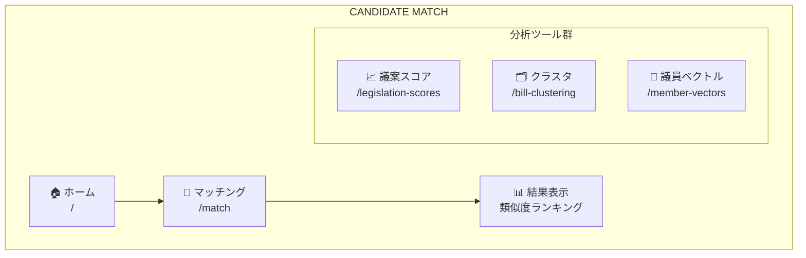
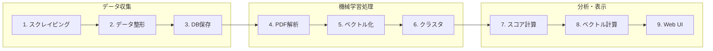
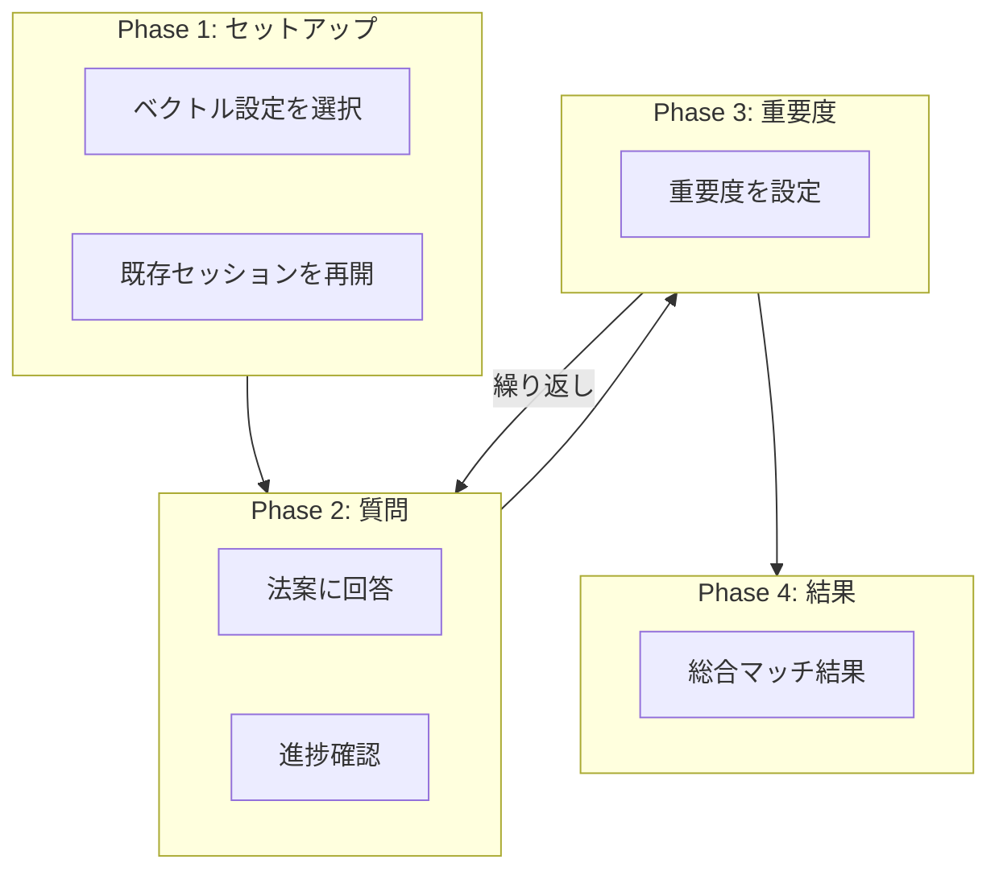
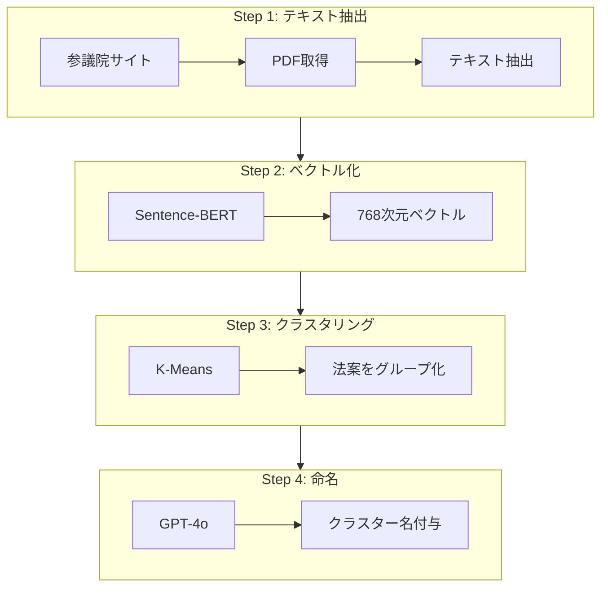
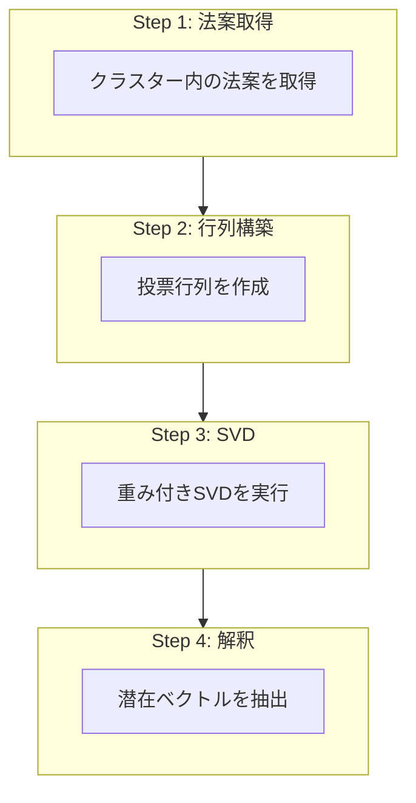

# Candidate Match ユーザーガイド（詳細版）

**あなたの政治的価値観に最も近い国会議員を見つけるための総合ガイド**

---

## 目次

1. [プラットフォーム概要](#1-プラットフォーム概要)
2. [システムアーキテクチャ](#2-システムアーキテクチャ)
3. [議員マッチング機能](#3-議員マッチング機能)
4. [議案別スコア分析](#4-議案別スコア分析)
5. [法案クラスタリング](#5-法案クラスタリング)
6. [議員ベクトル分析](#6-議員ベクトル分析)
7. [よくある質問](#7-よくある質問)

---

## 1. プラットフォーム概要

### 1.1 Candidate Matchとは

Candidate Matchは、機械学習とデータサイエンスを活用して、あなたの政治的価値観に最も近い国会議員を特定するプラットフォームです。

### 1.2 主な機能



### 1.3 データソース

| ソース | URL | 取得データ |
|--------|-----|------------|
| 参議院 | sangiin.go.jp | 法案PDF、投票記録、議員情報 |
| 衆議院 | shugiin.go.jp | 法案情報、委員会情報 |
| 首相官邸 | kantei.go.jp | 内閣構成情報 |
| 国会会議録 | kokkai.ndl.go.jp | 国会審議記録 |

---

## 2. システムアーキテクチャ

### 2.1 データパイプライン



| ステップ | ツール |
|----------|--------|
| 1. スクレイピング | scrape_*.ts |
| 3. DB保存 | PostgreSQL |
| 4. PDF解析 | PyPDF2 |
| 5. ベクトル化 | Sentence-BERT |
| 6. クラスタ | K-Means/SVD |
| 9. Web UI | SvelteKit |

### 2.2 使用技術

| カテゴリ | 技術 | 用途 |
|----------|------|------|
| フロントエンド | SvelteKit + Svelte 5 | ユーザーインターフェース |
| スタイリング | Tailwind CSS v4 | レスポンシブデザイン |
| バックエンド | Node.js + TypeScript | APIサーバー |
| データベース | PostgreSQL + Drizzle ORM | データ永続化 |
| ML/AI | Python (scikit-learn, sentence-transformers) | 機械学習処理 |
| 外部API | OpenAI GPT-4o | クラスター名の自動生成 |

---

## 3. 議員マッチング機能

**URL**: \`/match\`

議員マッチングは本プラットフォームの核心機能です。**Computerized Adaptive Testing (CAT)** アルゴリズムを使用して、最小限の質問数で最大限の精度を実現します。

### 3.1 アルゴリズム概要

#### 3.1.1 潜在空間の構築

議員の投票パターンを低次元の**潜在空間（Latent Space）**に圧縮します。

**Step 1: 投票行列の構築**

議員 × 法案 の M×N 行列を作成：

|  | 法案1 | 法案2 | 法案3 | 法案4 | ... |
|--|-------|-------|-------|-------|-----|
| 議員A | +5 | -5 | +2 | +5 | ... |
| 議員B | -5 | +5 | +2 | -5 | ... |
| 議員C | +5 | +5 | +2 | +5 | ... |
| ... | ... | ... | ... | ... | ... |

**Step 2: SVD（特異値分解）**

$$V = U \times \Sigma \times V^T$$

| 記号 | サイズ | 意味 |
|------|--------|------|
| U | M × d | 議員の潜在ベクトル |
| Σ | d × d | 特異値（重要度） |
| V | N × d | 法案の因子負荷量 |
| d | - | 潜在次元数（通常 1〜5） |

**Step 3: 潜在空間の可視化（概念図）**

各議員は d次元空間の1点として表現されます。例えば2次元の場合：
- **次元1**: 保守 ←→ 革新
- **次元2**: 経済重視 ←→ 福祉重視

#### 3.1.2 重み付け処理

法案の審議結果に応じて重要度を調整します：

| 審議結果 | 重み | 理由 |
|----------|------|------|
| 可決（Passed） | **1.0** | 最も信頼性の高い投票データ |
| 審議中（In Progress） | 0.8 | 現在進行中の審議 |
| 否決（Rejected） | 0.6 | 反対意見も重要な指標 |
| 撤回（Withdrawn） | 0.3 | 政治的意図は示唆される |
| 未了（Expired） | 0.2 | 会期末で審議未完了 |

```
重み付き行列: Ṽ = V × diag(w₁, w₂, ..., wₙ)
```

### 3.2 適応型質問選択アルゴリズム

#### 3.2.1 情報利得の最大化

CAT（Computerized Adaptive Testing）は、次の質問を**情報利得が最大**となるように選択します。

**目的**: 最も「情報量の多い」法案を次の質問として選択

各法案について以下を計算:

1. **不確実性スコア (Uncertainty Score)**
   - 不確実性が高い次元への因子負荷量が大きい法案ほど高評価
   - `uncertaintyScore = Σ |loading[d]| × uncertainty[d]`

2. **分散スコア (Variance Score)**
   - 議員間で意見が分かれる法案ほど高評価
   - `variance = Σ (score[m] - mean)² / M`

3. **複合スコア (Combined Score)**
   - `combinedScore = uncertaintyScore × (1 + √variance)`
   - → 最高スコアの法案を次の質問として提示

#### 3.2.2 ユーザーベクトルの更新

回答ごとにユーザーの潜在空間での位置を更新します。

```
回答後のユーザーベクトル推定:

   z_user = (VᵀV + λI)⁻¹ Vᵀ × scores

   V: 回答済み法案の因子負荷量行列
   scores: ユーザーの回答ベクトル (+1, 0, -1)
   λ: 正則化パラメータ (= 0.01)
   I: 単位行列

この式はリッジ回帰（L2正則化付き最小二乗法）に相当
```

### 3.3 マッチング計算

#### 3.3.1 コサイン類似度

ユーザーと各議員の類似度を計算します：

$$\text{similarity} = \frac{\text{user} \cdot \text{member}}{|\text{user}| \times |\text{member}|}$$

結果: -1 (正反対) 〜 +1 (完全一致)

**類似度計算の例**

| ベクトル | 値 |
|----------|------|
| ユーザー | [0.8, -0.3, 0.2] |
| 議員A | [0.7, -0.4, 0.3] |
| 議員B | [-0.6, 0.5, -0.1] |

計算例（ユーザーと議員A）:
- 内積: (0.8×0.7) + (-0.3×-0.4) + (0.2×0.3) = 0.56 + 0.12 + 0.06 = 0.74
- ノルム: |user| × |A| = 0.88 × 0.86 ≈ 0.76
- **類似度(User, A) ≈ 0.93 (93%マッチ)**
- **類似度(User, B) ≈ -0.82 (反対の立場)**

### 3.4 マッチングフロー詳細



**各フェーズの詳細**:

| フェーズ | 内容 |
|----------|------|
| Phase 1 | 保存済みベクトル設定を選択（例: 2024年通常国会 - 10クラスタ - 3次元）、または既存セッションを再開 |
| Phase 2 | 法案を表示し、👍 賛成 / 🤷 不明 / 👎 反対 で回答。進捗とリアルタイムプレビューを表示 |
| Phase 3 | クラスターの重要度を設定（★☆☆☆☆ 〜 ★★★★★）。全クラスター完了まで Phase 2-3 を繰り返し |
| Phase 4 | 加重平均による総合マッチ結果を表示 |

**Phase 4: 総合結果の例**

| 順位 | 議員名 | 政党・院 | マッチ度 | 各分野スコア |
|------|--------|----------|----------|--------------|
| 🏆 1位 | 山田 太郎 | ○○党・衆議院 | 92.3% | 経済 95% / 外交 88% / 社会保障 91% |
| 🥈 2位 | 鈴木 花子 | △△党・参議院 | 87.1% | 経済 82% / 外交 92% / 社会保障 85% |
| 🥉 3位 | 佐藤 一郎 | □□党・衆議院 | 84.5% | 経済 88% / 外交 79% / 社会保障 86% |

**操作ボタン**: 📥 セッションを保存 | 🔄 やり直す | 📤 結果を共有

### 3.5 セッション管理

#### 保存されるデータ

| テーブル | 内容 |
|----------|------|
| `saved_matching_sessions` | セッション基本情報（名前、説明、状態） |
| `saved_matching_session_cluster_results` | 各クラスターの回答結果とマッチ結果 |
| `saved_matching_session_cluster_answers` | 個別の法案への回答履歴 |
| `saved_matching_session_snapshots` | 任意時点でのスナップショット |

---

## 4. 議案別スコア分析

**URL**: `/legislation-scores`

各法案に対する議員のスコアを分析します。

### 4.1 スコア計算アルゴリズム

**1. 議案提出段階**

| 行動 | スコア | 説明 |
|------|--------|------|
| 提出者 (Sponsor) | **+10** | 閣法の場合、提出時の内閣総理大臣 |
| 賛成者 (Co-Sponsor) | **+5** | 法案に連名で署名した議員 |
| 同一会派メンバー | **+2** | 提出者と同じ政党・会派の議員（提出者・賛成者は除外） |

**2. 投票段階**

*衆議院（起立投票）*: 会派単位で賛否を記録

| 行動 | スコア |
|------|--------|
| 賛成会派所属 | **+2** |
| 反対会派所属 | **-2** |

*参議院（押しボタン式投票）*: 個人単位で賛否を記録

| 行動 | スコア |
|------|--------|
| 賛成 | **+5** |
| 反対 | **-5** |

### 4.2 スコア一覧表

| 行動 | スコア | 説明 |
|------|--------|------|
| 議案提出者 | **+10** | 法案の主提出者 |
| 賛成者（連名） | **+5** | 法案への連名署名者 |
| 押しボタン投票で賛成 | **+5** | 参議院の記名投票で賛成 |
| 押しボタン投票で反対 | **-5** | 参議院の記名投票で反対 |
| 起立投票で賛成（会派） | **+2** | 衆議院の起立投票で賛成会派所属 |
| 起立投票で反対（会派） | **-2** | 衆議院の起立投票で反対会派所属 |
| 同一会派（提出者と同じ） | **+2** | 提出者と同じ会派の所属議員 |

### 4.3 会派所属期間の拡張アルゴリズム

議員の所属会派は時期によって変わるため、正確な所属判定が必要です：

**問題**: `member_group` テーブルの日付にギャップがある場合がある

```
member_party:     |──────────── 自民党 ────────────|
member_group:     |── A派 ──|          |── B派 ──|
                            ↑ ギャップ ↑
```

**解決**: `member_party` の期間を使用して `member_group` を拡張

1. A派の終了日 → B派の開始日まで拡張
2. B派の開始日 → A派の終了日まで拡張
3. 結果として重複部分が発生（これは許容される）

```
拡張後:           |── A派 ────────|
                            |────── B派 ──|
                            ↑ 重複部分 ↑
```

> 💡 重複部分では両方の会派に所属していたとみなされます。

---

## 5. 法案クラスタリング

**URL**: `/bill-clustering`

機械学習で法案を類似性に基づいてグループ化します。

### 5.1 処理パイプライン



**各ステップの詳細**:

| ステップ | 処理内容 |
|----------|----------|
| Step 1 | 参議院ウェブサイトからPDFをスクレイピング、PyPDF2でタイトル・要旨・本文を抽出 |
| Step 2 | paraphrase-multilingual-mpnet-base-v2モデルで768次元ベクトルに変換（50以上の言語対応） |
| Step 3 | K-Meansアルゴリズムで類似法案をクラスタリング（中心点を繰り返し更新） |
| Step 4 | GPT-4oでクラスターに8文字以内の名前と説明文を自動生成 |

**クラスター命名の例**:
- クラスター0 → "環境・エネルギー": 地球温暖化対策や再生可能エネルギーに関する法案群
- クラスター1 → "地方財政・交付税": 地方自治体の財政基盤強化と交付税制度の改正

### 5.2 クラスタリングアルゴリズム比較

| アルゴリズム | K-Means | HDBSCAN |
|--------------|---------|---------|
| クラスター数 | 事前指定 | 自動決定 |
| 外れ値処理 | 強制的に割り当て | ノイズとして検出 |
| クラスター形状 | 球形を仮定 | 任意の形状に対応 |
| 高次元データ | 良好 | 注意が必要 |
| 推奨用途 | 本システム | 探索的分析 |

### 5.3 可視化

**2D PCA 散布図**

768次元のベクトルを2次元に圧縮して可視化します：

| シンボル | クラスター | トピック |
|----------|------------|----------|
| ● | クラスター0 | 環境・エネルギー |
| ▲ | クラスター1 | 地方財政・交付税 |
| ■ | クラスター2 | 外交・安全保障 |

> 同じクラスター内の法案は2D空間でも近くに配置され、意味的な類似性を視覚的に確認できます。

---

## 6. 議員ベクトル分析

**URL**: `/member-vectors`

議員の投票パターンを多次元ベクトルとして可視化します。

### 6.1 クラスター別潜在ベクトル分析



**各ステップの詳細**:

| ステップ | 処理内容 |
|----------|----------|
| Step 1 | bill_cluster_assignmentsテーブルからクラスター内の法案を取得（例: 環境・エネルギー 45件） |
| Step 2 | 議員×法案の行列を作成。欠損値は列平均で補完、スコアを[-1, 1]に正規化 |
| Step 3 | 法案結果に応じた重み付け（可決=1.0, 未了=0.2）後、中心化してSVDを実行 |
| Step 4 | U×Σの上位d列を議員潜在ベクトルとして抽出。代表法案と説明分散比も算出 |

**結果の例 (d=3)**:

| 議員 | ベクトル |
|------|----------|
| 議員1 | [0.45, -0.23, 0.12] |
| 議員2 | [-0.31, 0.67, 0.05] |
| 議員3 | [0.52, -0.18, 0.31] |

**説明分散比**: 次元1: 35% | 次元2: 22% | 次元3: 15% → 3次元で全体の72%を説明

### 6.2 類似議員検索

選択した議員と他の議員のコサイン類似度を計算:

$$\text{similarity} = \frac{A \cdot B}{|A| \times |B|}$$

**結果例（基準議員: 山田太郎）**:

| 順位 | 議員名 | 所属 | 類似度 |
|------|--------|------|--------|
| 1 | 鈴木花子 | 同党 | 0.95 |
| 2 | 佐藤一郎 | 同党 | 0.91 |
| 3 | 高橋次郎 | 他党 | 0.78 |
| 4 | 田中三郎 | 他党 | 0.65 |
| ... | ... | ... | ... |
| 50 | 渡辺四郎 | 他党 | -0.82 (反対) |

### 6.3 保存されたベクトルの活用

計算済みのベクトルはデータベースに保存され、マッチング機能で再利用されます：

**`cluster_vector_results` テーブル**:

| id | cluster_id | cluster_label | n_components | name |
|----|------------|---------------|--------------|------|
| 1 | 1 | 0 | 3 | 2024通常国会-経済 |
| 2 | 1 | 1 | 3 | 2024通常国会-外交 |
| 3 | 1 | -1 | 3 | 2024通常国会-全体 |

**保存されるデータ**:
- `member_vectors`: 各議員の潜在ベクトル
- `bill_loadings`: 各法案の因子負荷量
- `explained_variance`: 各次元の説明分散比
- `representative_bills`: 代表法案一覧

---

## 7. よくある質問

### 7.1 マッチングについて

**Q: 何問回答すれば正確な結果が得られますか？**

| 回答数 | 不確実性 | 信頼度 |
|--------|----------|--------|
| 1-4問 | 高い | 参考程度 |
| 5-9問 | 中程度 | ある程度信頼可能 |
| 10-19問 | 低い | 高い信頼度 |
| 20問以上 | 非常に低い | 非常に高い信頼度 |

**Q: 「わからない」を選んでも大丈夫ですか？**

はい。スコア0（中立）として処理されます。不確実性の低減には貢献しますが、あなたの立場を明確にする効果は限定的です。

**Q: なぜ質問の順番が変わるのですか？**

CAT（Computerized Adaptive Testing）アルゴリズムにより、あなたの回答履歴に基づいて最も情報量の多い法案が次の質問として選ばれます。これにより、少ない質問数で高精度なマッチングが可能になります。

**Q: セッションを保存するメリットは？**

- 途中で中断しても後から再開可能
- 複数回答セットを比較可能
- スナップショット機能で進捗を記録

### 7.2 スコアについて

**Q: 議員のスコアはどのように計算されますか？**

法案の提出、連名署名、および投票行動に基づいてスコアが計算されます。詳細は「4. 議案別スコア分析」を参照してください。

**Q: なぜ同じ政党でもスコアが異なりますか？**

参議院では個人単位の押しボタン投票が記録されるため、党議拘束があっても個人差が反映されます。また、法案への連名署名の有無も影響します。

**Q: マイナススコアの議員は悪い議員ですか？**

いいえ。スコアは単に法案に対する立場を示すもので、議員の良し悪しを評価するものではありません。反対票を投じることも民主主義において重要な役割です。

### 7.3 技術について

**Q: 使用している機械学習モデルは？**

| 用途 | モデル | 詳細 |
|------|--------|------|
| 法案のベクトル化 | Sentence-BERT | paraphrase-multilingual-mpnet-base-v2 (768次元) |
| 次元削減 | SVD | Singular Value Decomposition |
| クラスタリング | K-Means | scikit-learn実装 |
| クラスター命名 | GPT-4o | OpenAI API |

**Q: データはどのくらいの頻度で更新されますか？**

データは手動で更新されます。国会会期中は定期的なスクレイピングにより最新の法案・投票情報が反映されます。

**Q: 潜在次元数はどう選べばいいですか？**

| 次元数 | 特徴 |
|--------|------|
| 1 | 最もシンプル（例: 与党-野党の軸） |
| 2-3 | バランスが良く、可視化も容易（推奨） |
| 4-5 | より詳細だが解釈が難しくなる |

**Q: なぜ可決法案の重みが高いのですか？**

可決された法案は最終投票まで行われているため、議員の立場が最も明確に記録されています。未了や撤回された法案は情報が不完全な場合があります。

---

## 8. 数式まとめ

### 8.1 SVD（特異値分解）

投票行列 $V$ を分解：

$$V = U \Sigma V^T$$

| 記号 | サイズ | 意味 |
|------|--------|------|
| $V$ | $M \times N$ | 投票行列（議員 × 法案） |
| $U$ | $M \times d$ | 左特異ベクトル（議員の潜在表現） |
| $\Sigma$ | $d \times d$ | 特異値（各次元の重要度） |
| $V^T$ | $d \times N$ | 右特異ベクトル（法案の因子負荷量） |

### 8.2 コサイン類似度

2つのベクトル $A$ と $B$ の類似度：

$$\text{similarity}(A, B) = \frac{A \cdot B}{|A| \times |B|}$$

結果の範囲: $[-1, 1]$
- $+1$: 完全に一致
- $0$: 無関係
- $-1$: 完全に正反対

### 8.3 ユーザーベクトル推定（リッジ回帰）

回答済み法案の因子負荷量 $V$ とユーザーの回答 $s$ から位置を推定：

$$z_{user} = (V^T V + \lambda I)^{-1} V^T \cdot s$$

| 記号 | 意味 |
|------|------|
| $V$ | 回答済み法案の因子負荷量行列 |
| $s$ | ユーザーの回答ベクトル (+1, 0, -1) |
| $\lambda$ | 正則化パラメータ (= 0.01) |
| $I$ | 単位行列 |

### 8.4 加重平均マッチスコア

複数クラスターにわたる総合スコア：

$$S_m = \frac{\sum_{c} w_c \cdot \text{sim}(z_{user}^c, z_m^c)}{\sum_{c} w_c}$$

| 記号 | 意味 |
|------|------|
| $S_m$ | 議員 $m$ の総合マッチスコア |
| $w_c$ | クラスター $c$ の重要度（1〜5） |
| $z_{user}^c$ | クラスター $c$ でのユーザーベクトル |
| $z_m^c$ | クラスター $c$ での議員 $m$ のベクトル |

### 8.5 情報利得スコア（質問選択）

次の質問を選択するためのスコア：

$$\text{score}(b) = \left( \sum_{d} |l_{b,d}| \cdot u_d \right) \times (1 + \sqrt{\text{var}(b)})$$

| 記号 | 意味 |
|------|------|
| $l_{b,d}$ | 法案 $b$ の次元 $d$ への因子負荷量 |
| $u_d$ | 次元 $d$ の不確実性 |
| $\text{var}(b)$ | 法案 $b$ に対する議員間の分散 |

---

## 9. 関連ドキュメント

| ドキュメント | 内容 |
|-------------|------|
| [ADAPTIVE_MATCHING.md](./ADAPTIVE_MATCHING.md) | マッチングアルゴリズムの技術詳細 |
| [BILL_CLUSTERING.md](./BILL_CLUSTERING.md) | 法案クラスタリングの実装詳細 |
| [LEGISLATION_SCORES.md](./LEGISLATION_SCORES.md) | 議案スコア計算ロジック |
| [MEMBER_VECTORS.md](./MEMBER_VECTORS.md) | 議員ベクトル分析の詳細 |
| [BILL_ENRICHMENT.md](./BILL_ENRICHMENT.md) | AI法案要約機能 |
| [SCRAPING_SCRIPTS.md](./SCRAPING_SCRIPTS.md) | データ収集スクリプト |

---

*Last updated: December 2025*
