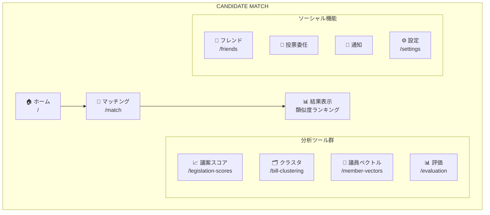
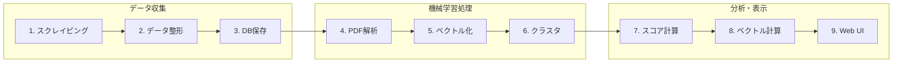
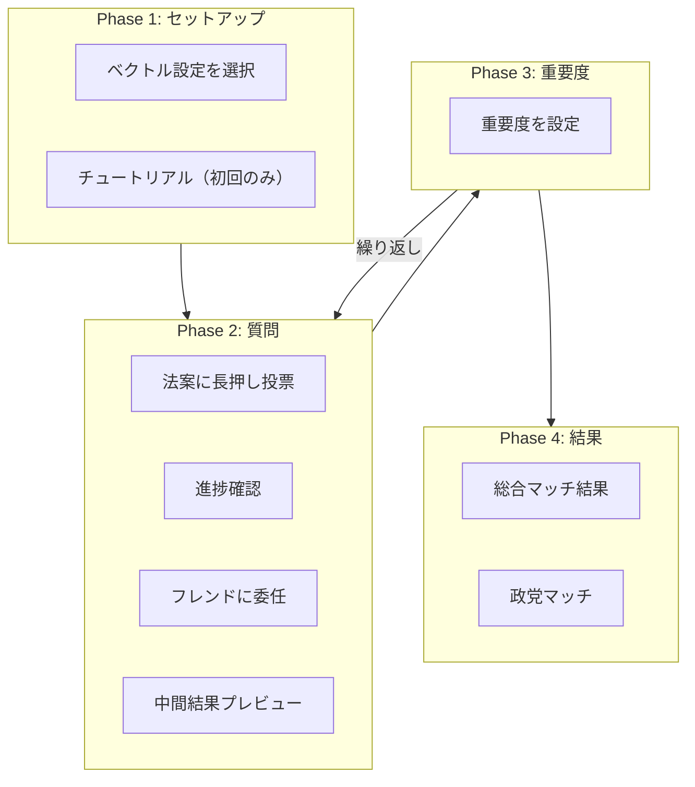
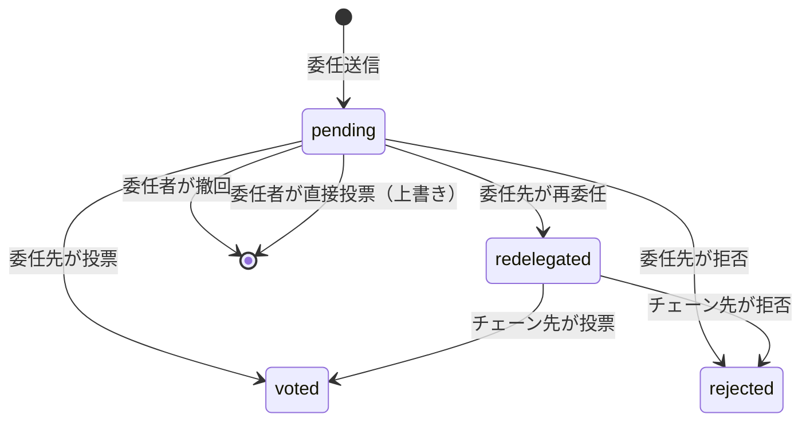
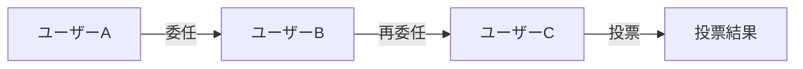
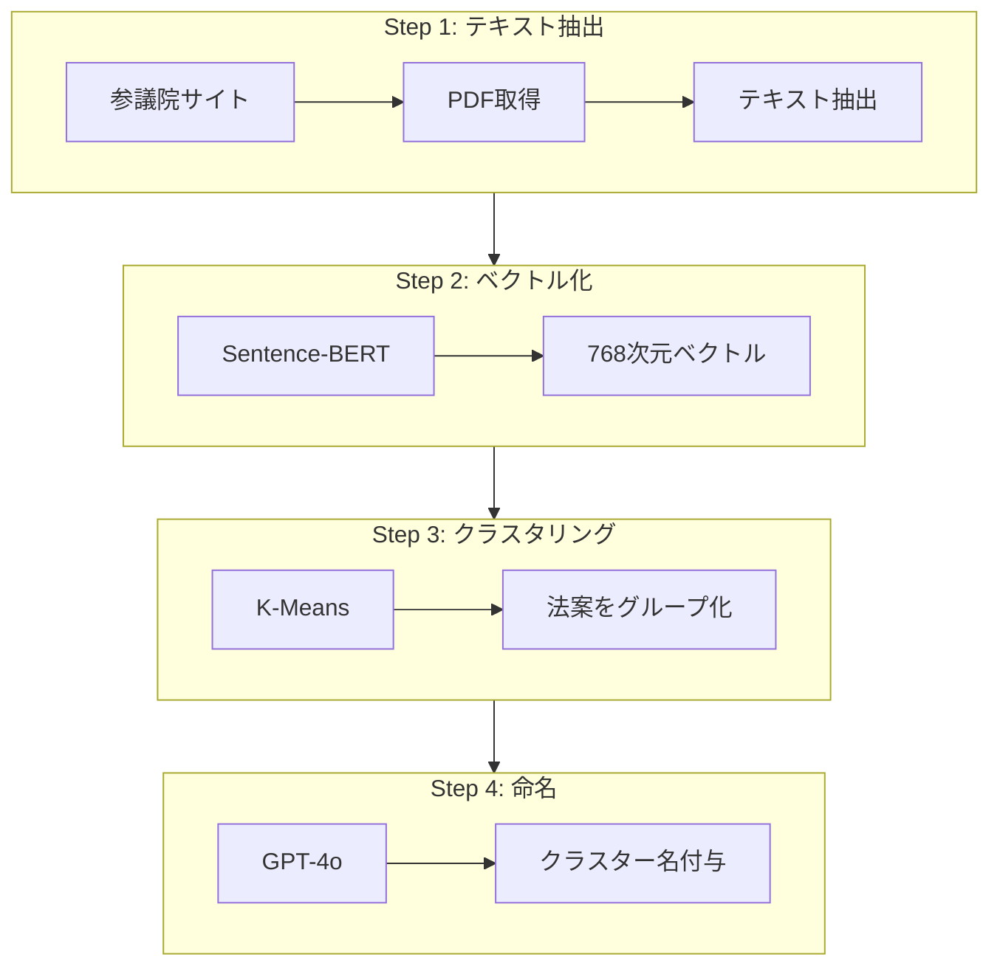
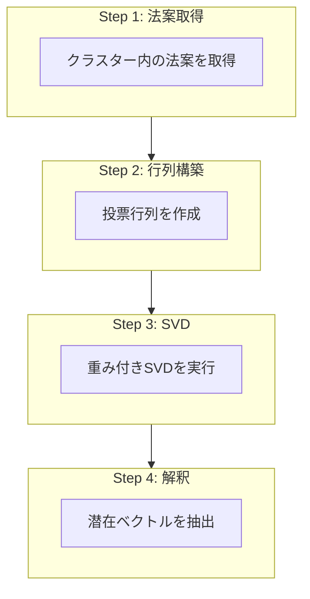

# Candidate Match ユーザーガイド（詳細版）

**あなたの政治的価値観に最も近い国会議員を見つけるための総合ガイド**

---

## 目次

1. [プラットフォーム概要](#1-プラットフォーム概要)
2. [システムアーキテクチャ](#2-システムアーキテクチャ)
3. [議員マッチング機能](#3-議員マッチング機能)
4. [フレンド機能](#4-フレンド機能)
5. [投票委任（リキッドデモクラシー）](#5-投票委任リキッドデモクラシー)
6. [通知システム](#6-通知システム)
7. [議案別スコア分析](#7-議案別スコア分析)
8. [法案クラスタリング](#8-法案クラスタリング)
9. [議員ベクトル分析](#9-議員ベクトル分析)
10. [アルゴリズム評価](#10-アルゴリズム評価)
11. [ユーザー設定](#11-ユーザー設定)
12. [よくある質問](#12-よくある質問)
13. [数式まとめ](#13-数式まとめ)
14. [関連ドキュメント](#14-関連ドキュメント)

---

## 1. プラットフォーム概要

### 1.1 Candidate Matchとは

Candidate Matchは、機械学習とデータサイエンスを活用して、あなたの政治的価値観に最も近い国会議員を特定するプラットフォームです。

### 1.2 主な機能


```mermaid
flowchart TB
    subgraph main["CANDIDATE MATCH"]
        Home["🏠 ホーム<br/>/"] --> Match["🎯 マッチング<br/>/match"]
        Match --> Result["📊 結果表示<br/>類似度ランキング"]
        
        subgraph Tools["分析ツール群"]
            Scores["📈 議案スコア<br/>/legislation-scores"]
            Cluster["🗂️ クラスタ<br/>/bill-clustering"]
            Vectors["📐 議員ベクトル<br/>/member-vectors"]
            Eval["📊 評価<br/>/evaluation"]
        end
        
        subgraph Social["ソーシャル機能"]
            Friends["👥 フレンド<br/>/friends"]
            Delegation["🔗 投票委任"]
            Notifications["🔔 通知"]
            Settings["⚙️ 設定<br/>/settings"]
        end
    end
```

### 1.3 データソース

| ソース | URL | 取得データ |
|--------|-----|------------|
| 参議院 | sangiin.go.jp | 法案PDF、投票記録、議員情報 |
| 衆議院 | shugiin.go.jp | 法案情報、委員会情報 |
| 首相官邸 | kantei.go.jp | 内閣構成情報 |
| 国会会議録 | kokkai.ndl.go.jp | 国会審議記録 |

---

## 2. システムアーキテクチャ

### 2.1 データパイプライン


```mermaid
flowchart LR
    subgraph Stage1["データ収集"]
        A1["1. スクレイピング"] --> A2["2. データ整形"] --> A3["3. DB保存"]
    end
    
    subgraph Stage2["機械学習処理"]
        B1["4. PDF解析"] --> B2["5. ベクトル化"] --> B3["6. クラスタ"]
    end
    
    subgraph Stage3["分析・表示"]
        C1["7. スコア計算"] --> C2["8. ベクトル計算"] --> C3["9. Web UI"]
    end
    
    A3 --> B1
    B3 --> C1
```

| ステップ | ツール |
|----------|--------|
| 1. スクレイピング | scrape_*.ts |
| 3. DB保存 | PostgreSQL |
| 4. PDF解析 | PyPDF2 |
| 5. ベクトル化 | Sentence-BERT |
| 6. クラスタ | K-Means/SVD |
| 9. Web UI | SvelteKit |

### 2.2 使用技術

| カテゴリ | 技術 | 用途 |
|----------|------|------|
| フロントエンド | SvelteKit + Svelte 5 | ユーザーインターフェース |
| スタイリング | Tailwind CSS v4 | レスポンシブデザイン |
| バックエンド | Node.js + TypeScript | APIサーバー |
| データベース | PostgreSQL + Drizzle ORM | データ永続化 |
| ML/AI | Python (scikit-learn, sentence-transformers) | 機械学習処理 |
| 外部API | OpenAI GPT-4o | クラスター名の自動生成 |

---

## 3. 議員マッチング機能

**URL**: \`/match\`

議員マッチングは本プラットフォームの核心機能です。**Computerized Adaptive Testing (CAT)** アルゴリズムを使用して、最小限の質問数で最大限の精度を実現します。

### 3.1 アルゴリズム概要

#### 3.1.1 潜在空間の構築

議員の投票パターンを低次元の**潜在空間（Latent Space）**に圧縮します。

**Step 1: 投票行列の構築**

議員 × 法案 の M×N 行列を作成：

|  | 法案1 | 法案2 | 法案3 | 法案4 | ... |
|--|-------|-------|-------|-------|-----|
| 議員A | +5 | -5 | +2 | +5 | ... |
| 議員B | -5 | +5 | +2 | -5 | ... |
| 議員C | +5 | +5 | +2 | +5 | ... |
| ... | ... | ... | ... | ... | ... |

**Step 2: SVD（特異値分解）**

$$V = U \times \Sigma \times V^T$$

| 記号 | サイズ | 意味 |
|------|--------|------|
| U | M × d | 議員の潜在ベクトル |
| Σ | d × d | 特異値（重要度） |
| V | N × d | 法案の因子負荷量 |
| d | - | 潜在次元数（通常 1〜5） |

**Step 3: 潜在空間の可視化（概念図）**

各議員は d次元空間の1点として表現されます。例えば2次元の場合：
- **次元1**: 保守 ←→ 革新
- **次元2**: 経済重視 ←→ 福祉重視

#### 3.1.2 重み付け処理

法案の審議結果に応じて重要度を調整します：

| 審議結果 | 重み | 理由 |
|----------|------|------|
| 可決（Passed） | **1.0** | 最も信頼性の高い投票データ |
| 審議中（In Progress） | 0.8 | 現在進行中の審議 |
| 否決（Rejected） | 0.6 | 反対意見も重要な指標 |
| 撤回（Withdrawn） | 0.3 | 政治的意図は示唆される |
| 未了（Expired） | 0.2 | 会期末で審議未完了 |

```
重み付き行列: Ṽ = V × diag(w₁, w₂, ..., wₙ)
```

### 3.2 適応型質問選択アルゴリズム

#### 3.2.1 情報利得の最大化

CAT（Computerized Adaptive Testing）は、次の質問を**情報利得が最大**となるように選択します。

**目的**: 最も「情報量の多い」法案を次の質問として選択

各法案について以下を計算:

1. **不確実性スコア (Uncertainty Score)**
   - 不確実性が高い次元への因子負荷量が大きい法案ほど高評価
   - `uncertaintyScore = Σ |loading[d]| × uncertainty[d]`

2. **分散スコア (Variance Score)**
   - 議員間で意見が分かれる法案ほど高評価
   - `variance = Σ (score[m] - mean)² / M`

3. **複合スコア (Combined Score)**
   - `combinedScore = uncertaintyScore × (1 + √variance)`
   - → 最高スコアの法案を次の質問として提示

> 💡 委任中（pending）の法案は質問選択でスキップされますが、委任済み（voted）の法案はベクトル推定に含まれます。

#### 3.2.2 ユーザーベクトルの更新

回答ごとにユーザーの潜在空間での位置を更新します。

```
回答後のユーザーベクトル推定:

   z_user = (VᵀV + λI)⁻¹ Vᵀ × scores

   V: 回答済み法案の因子負荷量行列（skip/わからない(score=0)の回答は除外）
   scores: ユーザーの回答ベクトル (yes=+1, no=-1, delegated=委任先の投票結果)
   λ: 正則化パラメータ (= 0.01)
   I: 単位行列

この式はリッジ回帰（L2正則化付き最小二乗法）に相当

不確実性はベイズ精度モデルで計算:
   uncertainty[d] = τ₀ / (τ₀ + D[d])
   τ₀: 事前精度 (= 0.4)
   D[d]: データからの情報量 (VᵀVの対角成分)
   → 20問程度で信頼度が高くなるよう調整済み
```

### 3.3 マッチング計算

#### 3.3.1 コサイン類似度

ユーザーと各議員の類似度を計算します：

$$\text{similarity} = \frac{\text{user} \cdot \text{member}}{|\text{user}| \times |\text{member}|}$$

結果: -1 (正反対) 〜 +1 (完全一致)

**類似度計算の例**

| ベクトル | 値 |
|----------|------|
| ユーザー | [0.8, -0.3, 0.2] |
| 議員A | [0.7, -0.4, 0.3] |
| 議員B | [-0.6, 0.5, -0.1] |

計算例（ユーザーと議員A）:
- 内積: (0.8×0.7) + (-0.3×-0.4) + (0.2×0.3) = 0.56 + 0.12 + 0.06 = 0.74
- ノルム: |user| × |A| = 0.88 × 0.86 ≈ 0.76
- **類似度(User, A) ≈ 0.93 (93%マッチ)**
- **類似度(User, B) ≈ -0.82 (反対の立場)**

### 3.4 マッチングフロー詳細


```mermaid
flowchart TB
    subgraph Phase1["Phase 1: セットアップ"]
        A1["ベクトル設定を選択"]
        A2["チュートリアル（初回のみ）"]
    end
    
    subgraph Phase2["Phase 2: 質問"]
        B1["法案に長押し投票"]
        B2["進捗確認"]
        B3["フレンドに委任"]
        B4["中間結果プレビュー"]
    end
    
    subgraph Phase3["Phase 3: 重要度"]
        C1["重要度を設定"]
    end
    
    subgraph Phase4["Phase 4: 結果"]
        D1["総合マッチ結果"]
        D2["政党マッチ"]
    end
    
    Phase1 --> Phase2
    Phase2 --> Phase3
    Phase3 -->|繰り返し| Phase2
    Phase3 --> Phase4
```

**各フェーズの詳細**:

| フェーズ | 内容 |
|----------|------|
| Phase 1 | 保存済みベクトル設定を選択（デフォルト設定は自動選択）。初回はチュートリアルモーダルで操作方法を解説 |
| Phase 2 | 法案を表示し、長押し投票（600msホールド）で 👍 賛成 / 🤷 不明 / 👎 反対 を回答。フレンドへの委任も可能。中間結果パネル（閉/狭/全の3モード）でリアルタイムマッチを確認 |
| Phase 3 | クラスターの重要度を設定（★☆☆☆☆ 〜 ★★★★★）。全クラスター完了まで Phase 2-3 を繰り返し |
| Phase 4 | 4タブ構成の結果表示：概要（TopMatchSpotlight）、回答記録（潜在空間可視化）、全議員リスト、政党マッチ |

**Phase 2: 質問画面の機能**

| 機能 | 説明 |
|------|------|
| 長押し投票 | ボタンを600ms以上ホールドで確定（プログレスアニメーション付き） |
| クラスター進捗チップ | 水平スクロールで全クラスターの進捗を確認・切替 |
| 回答編集 | 直近の回答をクリックして編集可能。キャンセルも可能 |
| フレンドに委任 | ログイン済みの場合、`DelegationModal` から法案をフレンドに委任 |
| 中間結果パネル | リアルタイムで暫定マッチ結果（議員/政党）を表示、潜在空間の2D可視化も可能 |
| 統計バッジ | 回答数 / スキップ数 / 委任済み / 委任中 / 未回答数 |
| 委任上書き確認 | 委任中の法案に直接投票すると確認ダイアログ表示 |

**Phase 4: 結果タブ詳細**

| タブ | 内容 |
|------|------|
| **概要** | トップ3マッチ（ゴールド/シルバー/ブロンズカード、分野別棒グラフ付き）+ クラスタ別上位マッチ |
| **回答記録** | クラスタ別に重要度★、潜在空間2D散布図、回答済み法案カード一覧 |
| **全議員リスト** | 検索・ソート可能なテーブル。クリックで詳細ドロワー（政党/会派歴、法案別スコア比較） |
| **政党マッチ** | 現在の所属議員ベース / 歴史的ベースの2モード。政党別マッチ度テーブル |

**操作ボタン**: 📥 スナップショットを保存 | ▶️ マッチングを続ける | 🔄 やり直す

### 3.5 セッション管理

回答データとスナップショットは分離されたアーキテクチャで管理されます。

#### 回答データ

| テーブル | 内容 |
|----------|------|
| `user_bill_answer` | ユーザー×法案のグローバル回答データ（`bill_answer_value` enum: `yes`/`no`/`skip`/`delegated`） |

回答はセッション単位ではなくユーザーアカウントにグローバルに紐づきます。同じ法案への再回答は上書きされます。

#### スナップショット

| テーブル | 内容 |
|----------|------|
| `result_snapshot` | 任意時点でのマッチ結果スナップショット（名前、グローバルスコアJSON、クラスタ結果JSON、vector_group_key） |

スナップショットはマッチ結果の「写真」として保存され、後から閲覧可能です。

#### `/match/saved` ページ

3つのタブで構成：

| タブ | 内容 |
|------|------|
| **スナップショット** | 保存済みスナップショット一覧の閲覧・削除。ベクトル設定を選んでライブ結果を再計算、スナップショットとして保存 |
| **回答履歴** | 全法案の回答管理（フィルタ：回答状態、賛否値、法案種別、会期、審議結果）。回答の撤回・変更、委任の送信 |
| **委任** | 受信・送信の委任を管理。フローチャートで委任チェーンを可視化。投票代行・再委任・拒否・撤回 |

---

## 4. フレンド機能

**URL**: `/friends`

他のユーザーとフレンドになり、投票委任などのソーシャル機能を利用できます。

### 4.1 画面構成

3つのタブで構成：

**① フレンド一覧 (Friends List)**
- フレンドのアバター、ユーザー名、フレンド登録日を表示
- フレンド解除ボタン（確認ダイアログ付き）
- フレンドがいない場合は検索タブへの導線を表示

**② リクエスト (Requests)**
- **受信リクエスト**: 承認/拒否ボタン付き
- **送信リクエスト**: キャンセルボタン付き
- 未処理件数がタブにバッジ表示

**③ ユーザー検索 (Search)**
- ユーザー名で検索（300msデバウンス）
- 検索結果にフレンド状態をインライン表示

### 4.2 データベース構造

| テーブル | カラム | 説明 |
|----------|--------|------|
| `friend_request` | `id`, `sender_id`, `receiver_id`, `status`, `created_at`, `updated_at` | フレンドリクエスト管理 |

`status` enum: `pending` / `accepted` / `rejected`

**制約**: sender_id と receiver_id のユニーク制約により、同じペア間の重複リクエストを防止。

### 4.3 ナビバー連携

- ユーザードロップダウンに「フレンド」リンク（未処理リクエスト件数バッジ付き）
- フレンドリクエスト受信時は赤ドットインジケーター表示

---

## 5. 投票委任（リキッドデモクラシー）

マッチング中の法案回答をフレンドに委任できます。フレンドシップが前提条件です。

### 5.1 委任ライフサイクル


```mermaid
stateDiagram-v2
    [*] --> pending: 委任送信
    pending --> voted: 委任先が投票
    pending --> rejected: 委任先が拒否
    pending --> redelegated: 委任先が再委任
    pending --> [*]: 委任者が撤回
    pending --> [*]: 委任者が直接投票（上書き）
    redelegated --> voted: チェーン先が投票
    redelegated --> rejected: チェーン先が拒否
```

**委任の状態遷移**:

| 状態 | 説明 |
|------|------|
| `pending` | 委任送信済み、委任先の回答待ち |
| `voted` | 委任先が投票を完了 |
| `rejected` | 委任先が拒否（委任者の `delegated` 状態が解除される） |
| `redelegated` | 委任先が別のフレンドに再委任（チェーン形成） |

### 5.2 チェーン委任


```mermaid
flowchart LR
    A["ユーザーA"] -->|委任| B["ユーザーB"]
    B -->|再委任| C["ユーザーC"]
    C -->|投票| D["投票結果"]
```

- `getDelegationChainDownstream/Upstream`: チェーンの上流・下流を辿る
- `getDelegationTreeUpstream`: 複数の上流委任者を含むツリー構造を取得
- `detectDelegationCycle()`: 循環委任（A→B→C→A）を検出・防止
- `resolveDelegatedVotes()`: チェーンを辿って最終投票者の回答をマッチング計算に反映
- `countTotalVotes()`: 特定ユーザーが代表するアップストリーム委任者の数を集計

### 5.3 マッチングへの統合

| 場面 | 動作 |
|------|------|
| 質問画面 | 法案ごとに「フレンドに委任」ボタンを表示。`DelegationModal` でフレンド選択 |
| 回答編集 | 委任中の法案に直接投票すると、確認ダイアログ後に委任がキャンセルされる |
| ベクトル推定 | `resolveDelegatedVotes()` で委任先の投票結果を取得し、ユーザーの回答として使用 |
| 統計表示 | 回答数 / スキップ数 / 委任済み（voted） / 委任中（pending）を分けて表示 |

### 5.4 可視化

`/match/saved` の委任タブでは `DelegationFlowChart`（`@xyflow/svelte` ベース）で委任チェーンをフローチャートとして可視化。カスタムノード `DelegationFlowNode` でユーザー情報・投票状態を表示。

### 5.5 データベース構造

| テーブル | カラム | 説明 |
|----------|--------|------|
| `vote_delegation` | `id`, `delegator_id`, `delegate_id`, `bill_id`, `status`, `parent_delegation_id`, `created_at`, `updated_at` | 委任管理 |

`status` enum: `pending` / `rejected` / `redelegated` / `voted`

`parent_delegation_id` は再委任チェーンの親リンク（自己参照FK）。

---

## 6. 通知システム

ナビバーの🔔アイコンからアクセスできるドロップダウン通知システムです。

### 6.1 通知タイプ

| カテゴリ | タイプ | 説明 |
|----------|--------|------|
| フレンド | `friend_request_received` | フレンドリクエストが届いた |
| フレンド | `friend_request_accepted` | フレンドリクエストが承認された |
| フレンド | `friend_request_rejected` | フレンドリクエストが拒否された |
| 委任 | `delegation_received` | 法案の委任依頼が届いた |
| 委任 | `delegation_rejected` | 委任が拒否された |
| 委任 | `delegation_redelegated` | 委任が再委任された |
| 委任 | `delegation_voted` | 委任先が投票した |
| 委任 | `delegation_retracted` | 委任者が委任を撤回した |
| 委任 | `delegation_vote_changed` | 委任先が投票を変更した |
| 委任 | `delegation_overridden` | 委任者が直接投票で上書きした |
| システム | `welcome` | ウェルカム通知 |

### 6.2 UI機能

| 機能 | 説明 |
|------|------|
| 未読バッジ | ナビバーの🔔に未読件数を表示 |
| ドロップダウン | 通知一覧をページネーション（カーソルベース）で表示 |
| 既読処理 | 個別の「既読」/「全て既読」ボタン |
| ナビゲーション | 通知クリックで `/friends` や `/match/saved` に遷移 |
| タイプ別アイコン | 通知タイプごとに異なるアイコンを表示 |

### 6.3 データベース構造

| テーブル | カラム | 説明 |
|----------|--------|------|
| `notification` | `id`, `user_id`, `type`, `title`, `message`, `link`, `related_user_id`, `is_read`, `created_at` | 通知管理 |

---

## 7. 議案別スコア分析

**URL**: `/legislation-scores`

各法案に対する議員のスコアを分析します。

### 7.1 スコア計算アルゴリズム

**1. 議案提出段階**

| 行動 | スコア | 説明 |
|------|--------|------|
| 提出者 (Sponsor) | **+10** | 閣法の場合、提出時の内閣総理大臣 |
| 賛成者 (Co-Sponsor) | **+5** | 法案に連名で署名した議員 |
| 同一会派メンバー | **+2** | 提出者と同じ政党・会派の議員（提出者・賛成者は除外） |

**2. 投票段階**

*衆議院*: 会派単位で賛否を記録

| 行動 | スコア |
|------|--------|
| 賛成会派所属 | **+2** |
| 反対会派所属 | **-2** |

*参議院*: 個人単位で賛否を記録

| 行動 | スコア |
|------|--------|
| 賛成 | **+5** |
| 反対 | **-5** |

### 7.2 スコア一覧表

| 行動 | スコア | 説明 |
|------|--------|------|
| 議案提出者 | **+10** | 法案の主提出者 |
| 賛成者（連名） | **+5** | 法案への連名署名者 |
| 参議院の個人投票で賛成 | **+5** | 参議院の記名投票で賛成 |
| 参議院の個人投票で反対 | **-5** | 参議院の記名投票で反対 |
| 衆議院の会派投票で賛成 | **+2** | 衆議院の会派投票で賛成会派所属 |
| 衆議院の会派投票で反対 | **-2** | 衆議院の会派投票で反対会派所属 |
| 同一会派（提出者と同じ） | **+2** | 提出者と同じ会派の所属議員 |

> 💡 スコアは院（衆議院/参議院）で区別されます。衆議院は会派単位、参議院は個人単位です。

### 7.3 会派所属期間の拡張アルゴリズム

議員の所属会派は時期によって変わるため、正確な所属判定が必要です：

**問題**: `member_group` テーブルの日付にギャップがある場合がある

```
member_party:     |──────────── 自民党 ────────────|
member_group:     |── A派 ──|          |── B派 ──|
                            ↑ ギャップ ↑
```

**解決**: `member_party` の期間を使用して `member_group` を拡張

1. A派の終了日 → B派の開始日まで拡張
2. B派の開始日 → A派の終了日まで拡張
3. 結果として重複部分が発生（これは許容される）

```
拡張後:           |── A派 ────────|
                            |────── B派 ──|
                            ↑ 重複部分 ↑
```

> 💡 重複部分では両方の会派に所属していたとみなされます。

---

## 8. 法案クラスタリング

**URL**: `/bill-clustering`

機械学習で法案を類似性に基づいてグループ化します。

### 8.1 処理パイプライン


```mermaid
flowchart TB
    subgraph Step1["Step 1: テキスト抽出"]
        A1["参議院サイト"] --> A2["PDF取得"] --> A3["テキスト抽出"]
    end
    
    subgraph Step2["Step 2: ベクトル化"]
        B1["Sentence-BERT"] --> B2["768次元ベクトル"]
    end
    
    subgraph Step3["Step 3: クラスタリング"]
        C1["K-Means"] --> C2["法案をグループ化"]
    end
    
    subgraph Step4["Step 4: 命名"]
        D1["GPT-4o"] --> D2["クラスター名付与"]
    end
    
    Step1 --> Step2 --> Step3 --> Step4
```

**各ステップの詳細**:

| ステップ | 処理内容 |
|----------|----------|
| Step 1 | 参議院ウェブサイトからPDFをスクレイピング、PyPDF2でタイトル・要旨・本文を抽出 |
| Step 2 | paraphrase-multilingual-mpnet-base-v2モデルで768次元ベクトルに変換（50以上の言語対応） |
| Step 3 | K-Meansアルゴリズムで類似法案をクラスタリング（中心点を繰り返し更新） |
| Step 4 | GPT-4oでクラスターに8文字以内の名前と説明文を自動生成 |

**クラスター命名の例**:
- クラスター0 → "環境・エネルギー": 地球温暖化対策や再生可能エネルギーに関する法案群
- クラスター1 → "地方財政・交付税": 地方自治体の財政基盤強化と交付税制度の改正

### 8.2 クラスタリングアルゴリズム比較

| アルゴリズム | K-Means | HDBSCAN |
|--------------|---------|---------|
| クラスター数 | 事前指定 | 自動決定 |
| 外れ値処理 | 強制的に割り当て | ノイズとして検出 |
| クラスター形状 | 球形を仮定 | 任意の形状に対応 |
| 高次元データ | 良好 | 注意が必要 |
| 推奨用途 | 本システム | 探索的分析 |

### 8.3 可視化

**2D PCA 散布図**

768次元のベクトルを2次元に圧縮して可視化します：

| シンボル | クラスター | トピック |
|----------|------------|----------|
| ● | クラスター0 | 環境・エネルギー |
| ▲ | クラスター1 | 地方財政・交付税 |
| ■ | クラスター2 | 外交・安全保障 |

> 同じクラスター内の法案は2D空間でも近くに配置され、意味的な類似性を視覚的に確認できます。

---

## 9. 議員ベクトル分析

**URL**: `/member-vectors`

議員の投票パターンを多次元ベクトルとして可視化します。

### 9.1 クラスター別潜在ベクトル分析


```mermaid
flowchart TB
    subgraph Step1["Step 1: 法案取得"]
        A1["クラスター内の法案を取得"]
    end
    
    subgraph Step2["Step 2: 行列構築"]
        B1["投票行列を作成"]
    end
    
    subgraph Step3["Step 3: SVD"]
        C1["重み付きSVDを実行"]
    end
    
    subgraph Step4["Step 4: 解釈"]
        D1["潜在ベクトルを抽出"]
    end
    
    Step1 --> Step2 --> Step3 --> Step4
```

**各ステップの詳細**:

| ステップ | 処理内容 |
|----------|----------|
| Step 1 | bill_cluster_assignmentsテーブルからクラスター内の法案を取得（例: 環境・エネルギー 45件） |
| Step 2 | 議員×法案の行列を作成。欠損値は列平均で補完、スコアを[-1, 1]に正規化 |
| Step 3 | 法案結果に応じた重み付け（可決=1.0, 未了=0.2）後、中心化してSVDを実行 |
| Step 4 | U×Σの上位d列を議員潜在ベクトルとして抽出。代表法案と説明分散比も算出 |

**結果の例 (d=3)**:

| 議員 | ベクトル |
|------|----------|
| 議員1 | [0.45, -0.23, 0.12] |
| 議員2 | [-0.31, 0.67, 0.05] |
| 議員3 | [0.52, -0.18, 0.31] |

**説明分散比**: 次元1: 35% | 次元2: 22% | 次元3: 15% → 3次元で全体の72%を説明

### 9.2 類似議員検索

選択した議員と他の議員のコサイン類似度を計算:

$$\text{similarity} = \frac{A \cdot B}{|A| \times |B|}$$

**結果例（基準議員: 山田太郎）**:

| 順位 | 議員名 | 所属 | 類似度 |
|------|--------|------|--------|
| 1 | 鈴木花子 | 同党 | 0.95 |
| 2 | 佐藤一郎 | 同党 | 0.91 |
| 3 | 高橋次郎 | 他党 | 0.78 |
| 4 | 田中三郎 | 他党 | 0.65 |
| ... | ... | ... | ... |
| 50 | 渡辺四郎 | 他党 | -0.82 (反対) |

### 9.3 保存されたベクトルの活用

計算済みのベクトルはデータベースに保存され、マッチング機能で再利用されます：

**`cluster_vector_results` テーブル**:

| id | cluster_id | cluster_label | n_components | name | is_default |
|----|------------|---------------|--------------|------|------------|
| 1 | 1 | 0 | 3 | 2024通常国会-経済 | false |
| 2 | 1 | 1 | 3 | 2024通常国会-外交 | false |
| 3 | 1 | -1 | 3 | 2024通常国会-全体 | true |

> 💡 管理者は `is_default` をマークして、`/match` ページでの自動選択を有効にできます

**保存されるデータ**:
- `member_vectors`: 各議員の潜在ベクトル
- `member_names`: 各議員の名前マッピング
- `bill_loadings`: 各法案の因子負荷量
- `bill_ids`: 対象法案IDリスト
- `explained_variance`: 各次元の説明分散比
- `representative_bills`: 代表法案一覧

---

## 10. アルゴリズム評価

**URL**: `/evaluation`

マッチングアルゴリズムの精度を評価するツールです。

### 10.1 概要

保存済みのベクトル設定を使用して、マッチングアルゴリズムのパフォーマンスを定量的に評価します。

### 10.2 使い方

1. 保存済みベクトル設定（`SavedVector`）を選択
2. 評価戦略を実行
3. 集計メトリクスを確認

### 10.3 評価メトリクス

| メトリクス | 説明 |
|------------|------|
| 平均コサイン誤差 | 推定ベクトルと真のベクトルのコサイン距離 |
| ベクトルMSE | 推定ベクトルと真のベクトルの平均二乗誤差 |
| 不確実性 | 残存する不確実性の量 |
| 真の順位 | 真のマッチ相手がランキングのどこに位置するか |
| Top-5命中率 | 真のベスト5マッチがTop-5に入る割合 |
| 収束度 | アルゴリズムが安定したベクトルに収束する速さ |

議員単位の詳細結果をステップごとに確認し、質問選択がどのようにユーザーベクトルを改善していくかを分析できます。

---

## 11. ユーザー設定

**URL**: `/settings`

### 11.1 プロフィール画像

アバター画像をImageKit CDN経由でアップロード・管理します。

| 項目 | 詳細 |
|------|------|
| 対応形式 | JPEG, PNG, WebP, GIF |
| 最大サイズ | 5MB |
| 機能 | アップロード、削除 |

アバターは `Avatar` コンポーネントを通じてフレンドリスト、ナビバー、通知などプラットフォーム全体で表示されます。

### 11.2 ユーザー名

| 項目 | 詳細 |
|------|------|
| 使用可能文字 | 英数字、ハイフン、アンダースコア |
| 文字数制限 | 3〜32文字 |

### 11.3 パスワード変更

| 項目 | 詳細 |
|------|------|
| 必要入力 | 現在のパスワード、新しいパスワード、確認入力 |
| 文字数制限 | 8〜128文字 |

### 11.4 認証

| ルート | 説明 |
|--------|------|
| `/auth/login` | ユーザー名+パスワードでログイン |
| `/auth/register` | 新規アカウント登録 |
| `/auth/logout` | ログアウト |

ユーザーロール: `user` / `admin`（管理者はデフォルトベクトル設定の管理などが可能）

---

## 12. よくある質問

### 12.1 マッチングについて

**Q: 何問回答すれば正確な結果が得られますか？**

| 回答数 | 不確実性 | 信頼度 |
|--------|----------|--------|
| 1-4問 | 高い | 参考程度 |
| 5-9問 | 中程度 | ある程度信頼可能 |
| 10-19問 | 低い | 高い信頼度 |
| 20問以上 | 非常に低い | 非常に高い信頼度 |

**Q: 「わからない」を選んでも大丈夫ですか？**

はい。スコア0（中立）として処理されます。不確実性の低減には貢献しますが、あなたの立場を明確にする効果は限定的です。

**Q: なぜ質問の順番が変わるのですか？**

CAT（Computerized Adaptive Testing）アルゴリズムにより、あなたの回答履歴に基づいて最も情報量の多い法案が次の質問として選ばれます。これにより、少ない質問数で高精度なマッチングが可能になります。

**Q: セッションを保存するメリットは？**

- スナップショットとして結果を永続保存
- いつでも `/match/saved` から閲覧可能
- 異なる時期の結果を比較可能

### 12.2 委任について

**Q: 投票委任とは何ですか？**

法案の回答をフレンドに委ねる機能です。委任先のフレンドがあなたの代わりに投票し、その結果がマッチング計算に反映されます。

**Q: 委任チェーンとは？**

A→B→C のように委任が連鎖するケースです。Cが投票すると、B経由でAの回答としても反映されます。循環委任（A→B→C→A）は自動検出・防止されます。

**Q: 委任を取り消せますか？**

はい、いつでも撤回できます。また、委任中の法案に自分で直接投票することでも委任がキャンセルされます。

### 12.3 スコアについて

**Q: 議員のスコアはどのように計算されますか？**

法案の提出、連名署名、および投票行動に基づいてスコアが計算されます。詳細は「7. 議案別スコア分析」を参照してください。

**Q: なぜ同じ政党でもスコアが異なりますか？**

参議院では個人単位の投票が記録されるため、党議拘束があっても個人差が反映されます。また、法案への連名署名の有無も影響します。

**Q: マイナススコアの議員は悪い議員ですか？**

いいえ。スコアは単に法案に対する立場を示すもので、議員の良し悪しを評価するものではありません。反対票を投じることも民主主義において重要な役割です。

### 12.4 技術について

**Q: 使用している機械学習モデルは？**

| 用途 | モデル | 詳細 |
|------|--------|------|
| 法案のベクトル化 | Sentence-BERT | paraphrase-multilingual-mpnet-base-v2 (768次元) |
| 次元削減 | SVD | Singular Value Decomposition |
| クラスタリング | K-Means | scikit-learn実装 |
| クラスター命名 | GPT-4o | OpenAI API |

**Q: データはどのくらいの頻度で更新されますか？**

データは手動で更新されます。国会会期中は定期的なスクレイピングにより最新の法案・投票情報が反映されます。

**Q: 潜在次元数はどう選べばいいですか？**

| 次元数 | 特徴 |
|--------|------|
| 1 | 最もシンプル（例: 与党-野党の軸） |
| 2-3 | バランスが良く、可視化も容易（推奨） |
| 4-5 | より詳細だが解釈が難しくなる |

**Q: なぜ可決法案の重みが高いのですか？**

可決された法案は最終投票まで行われているため、議員の立場が最も明確に記録されています。未了や撤回された法案は情報が不完全な場合があります。

---

## 13. 数式まとめ

### 13.1 SVD（特異値分解）

投票行列 $V$ を分解：

$$V = U \Sigma V^T$$

| 記号 | サイズ | 意味 |
|------|--------|------|
| $V$ | $M \times N$ | 投票行列（議員 × 法案） |
| $U$ | $M \times d$ | 左特異ベクトル（議員の潜在表現） |
| $\Sigma$ | $d \times d$ | 特異値（各次元の重要度） |
| $V^T$ | $d \times N$ | 右特異ベクトル（法案の因子負荷量） |

### 13.2 コサイン類似度

2つのベクトル $A$ と $B$ の類似度：

$$\text{similarity}(A, B) = \frac{A \cdot B}{|A| \times |B|}$$

結果の範囲: $[-1, 1]$
- $+1$: 完全に一致
- $0$: 無関係
- $-1$: 完全に正反対

### 13.3 ユーザーベクトル推定（リッジ回帰）

回答済み法案の因子負荷量 $V$ とユーザーの回答 $s$ から位置を推定：

$$z_{user} = (V^T V + \lambda I)^{-1} V^T \cdot s$$

| 記号 | 意味 |
|------|------|
| $V$ | 回答済み法案の因子負荷量行列 |
| $s$ | ユーザーの回答ベクトル (yes=+1, skip=0, no=-1) |
| $\lambda$ | 正則化パラメータ (= 0.01) |
| $I$ | 単位行列 |

### 13.4 加重平均マッチスコア

複数クラスターにわたる総合スコア：

$$S_m = \frac{\sum_{c} w_c \cdot \text{sim}(z_{user}^c, z_m^c)}{\sum_{c} w_c}$$

| 記号 | 意味 |
|------|------|
| $S_m$ | 議員 $m$ の総合マッチスコア |
| $w_c$ | クラスター $c$ の重要度（1〜5） |
| $z_{user}^c$ | クラスター $c$ でのユーザーベクトル |
| $z_m^c$ | クラスター $c$ での議員 $m$ のベクトル |

### 13.5 情報利得スコア（質問選択）

次の質問を選択するためのスコア：

$$\text{score}(b) = \left( \sum_{d} |l_{b,d}| \cdot u_d \right) \times (1 + \sqrt{\text{var}(b)})$$

| 記号 | 意味 |
|------|------|
| $l_{b,d}$ | 法案 $b$ の次元 $d$ への因子負荷量 |
| $u_d$ | 次元 $d$ の不確実性 |
| $\text{var}(b)$ | 法案 $b$ に対する議員間の分散 |

---

## 14. 関連ドキュメント

| ドキュメント | 内容 |
|-------------|------|
| [ADAPTIVE_MATCHING.md](./ADAPTIVE_MATCHING.md) | マッチングアルゴリズムの技術詳細 |
| [BILL_CLUSTERING.md](./BILL_CLUSTERING.md) | 法案クラスタリングの実装詳細 |
| [LEGISLATION_SCORES.md](./LEGISLATION_SCORES.md) | 議案スコア計算ロジック |
| [MEMBER_VECTORS.md](./MEMBER_VECTORS.md) | 議員ベクトル分析の詳細 |
| [BILL_ENRICHMENT.md](./BILL_ENRICHMENT.md) | AI法案要約機能 |
| [PARTY_MATCHING.md](./PARTY_MATCHING.md) | 政党マッチングアルゴリズム |
| [ALGORITHM_EVALUATION.md](./ALGORITHM_EVALUATION.md) | アルゴリズム評価フレームワーク |
| [SCRAPING_SCRIPTS.md](./SCRAPING_SCRIPTS.md) | データ収集スクリプト |

---

*Last updated: April 2026*
